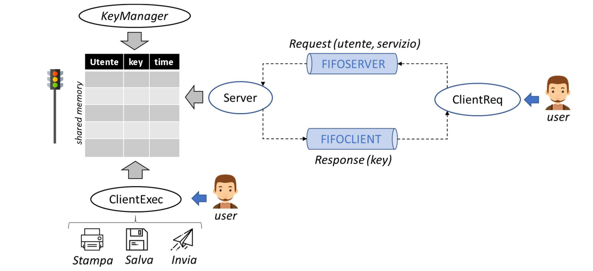

# System Call project
This is the final project for the 'Operating Systems' course at the University of Verona, during the second year of bachelor's degree in Computer Science.
We had to create an application for the management of the following system services: Print, Save, and Send. Figure below shows the scheme of the required Client-Server architecture.

## Architecture
 

## Main components
- **ClientReq** : program used by the user to request a usage key for a system service.
- **Server**: program responsible for the release of the use keys for the services of system available.
- **KeyManager**: program responsible for storing and managing all keys issued for the use of a system service.
- **ClientExec**: program that must perform the service requested by the user.
- **Print**: program that performs the print service.
- **Save**: program that performs the save service.
- **Send**: program that performs the sending service.

## Topics used:
- [x] FIFO
- [x] Shared Memory
- [x] Signals
- [x] Semaphore
- [x] Hash Function
- [x] Message Queues

## Authors

* **Luca Marzari** - [LM095](https://github.com/LM095)
* **Deborah Pintani** - [DebbyX3](https://github.com/DebbyX3)

